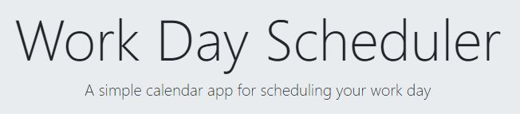

# Work Day Scheduler Starter Code

## Overview: 

I created a simple calendar application that allows a user to save events for each hour of the day. This app features dynamically updated HTML and CSS powered by jQuery. 

## Technologies used: 
  * HTML
  * CSS
  * Bootstrap
  * JavaScript
  * JQuery

View live site at: 

GIVEN I am using a daily planner to create a schedule
WHEN I open the planner
THEN the current day is displayed at the top of the calendar
WHEN I scroll down
THEN I am presented with time blocks for standard business hours
WHEN I view the time blocks for that day
THEN each time block is color-coded to indicate whether it is in the past, present, or future
WHEN I click into a time block
THEN I can enter an event
WHEN I click the save button for that time block
THEN the text for that event is saved in local storage
WHEN I refresh the page
THEN the saved events persist